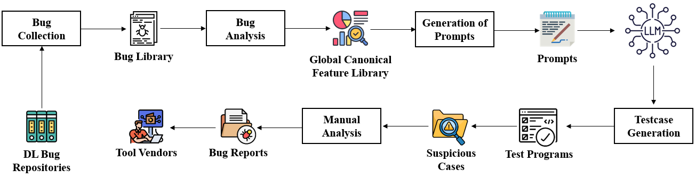

# Replication Package — Testing Deep-Learning Libraries

This repository is the replication package for our ICSE submission entitled
**"LLM-based Feature-Guided Test Case Generation for Deep Learning Libraries."**

## Overview of the pipeline

  

*Figure: the GCFL-guided pipeline. Bug Collection → Bug Library → Feature
Extraction → GCFL Construction → Prompt-Pack Generation → LLM test synthesis →
Execution → Manual Triage, with validated defects fed back into the GCFL. The
same figure appears as Figure 1 in the paper.*

A bug-driven, GCFL-guided pipeline for test generation, execution, and upstream
reporting across five production-grade DL libraries: **TensorFlow, Keras, Apache
TVM, DeepSpeed, and MXNet.**

The artifact contains:

- A curated structured bug dataset (JSON) mined from DL-library issue trackers.
- The GCFL construction pipeline (multi-signal clustering over structured bug
  entries: nodes are linked primarily by shared structured precondition/trigger/
  oracle signals, with keyword Jaccard similarity used only as a fallback;
  clusters are the connected components).
- Scripts to build prompt packs from GCFL clusters.
- The generated testcases (Python) following a strict execution contract.
- The bugs reported to their respective DL-library issue trackers
  (`reported_bugs.pdf`).

### Main pipeline

1. Structured bug entries
2. GCFL clustering (multi-signal union-find)
3. Prompt packs
4. LLM testcase generation (self-contained Python)
5. Execution + triage (Anomaly / No-Anomaly / SKIP_ENV)
6. Manual confirmation + upstream reporting
7. Reported outcomes

### Reported outcomes

From **148** curated buggy/fixed records we built **16 multi-member GCFL clusters**
and generated **160** testcases (10 per cluster). At the time of writing, **130**
of these have been executed and manually triaged, producing **14** unique upstream
bug reports, of which **5** are developer-confirmed (including a maintainer-verified
DeepSpeed ZeRO-3 defect). Remaining reports are pending or undecided.

## 2. Repository layout
testing_deeplearning_libraries/
├─ dataset/
│  ├─ feature_all.json                 # raw structured entries
│  ├─ feature_all_with_scenario.json   # entries with scenario labels
│  ├─ testcases/
│  │  ├─ deepspeed/
│  │  ├─ keras/
│  │  ├─ mxnet/
│  │  ├─ tensorflow/
│  │  └─ tvm/
│  └─ testcases_generation/
│     └─ generate_testcases.py
├─ scripts/
│  ├─ gcfl/
│  │  ├─ GCFL_v12.py                    # multi-signal clustering (union-find)
│  │  ├─ GCFL_B.json
│  │  └─ GCFL_B_diagnostics.json
│  ├─ prompt_pack_construction/
│  │  ├─ make_prompt_pack_v2.py
│  │  ├─ make_prompt_pack.py
│  │  ├─ GCFL_B_loosen1_prompts_v2.json
│  │  └─ GCFL_B_loosen1_prompts.json
│  ├─ tools/
│  │  ├─ add_scenario.py
│  │  └─ summarize_results.py
│  ├─ bug_extraction.py
│  └─ reported_bugs.pdf
└─ README.md

## Execution contract

Every testcase in this repo follows the same machine-checkable contract.

**Required output**

- Early: one line starting with `ENV:` containing JSON environment metadata.
- Final line must be exactly one of:
  - `RESULT: ANOMALY`   → the targeted suspicious behavior was triggered
  - `RESULT: CLEAN`     → the behavior was not observed
  - `SKIP_ENV: <reason>` → environment mismatch / not runnable here

> Note: earlier testcase versions printed `Test Passed ✅ / Test Failed ❌`. These
> are equivalent to `ANOMALY / CLEAN` respectively; a *triggered anomaly is a
> candidate for triage, not a confirmed bug.* New testcases use the `RESULT:` form
> for unambiguous parsing.

**Self-contained rule**

- No external downloads, datasets, or network usage.
- No external config files required at repo level (a testcase writes any temp
  config it needs internally).

**Environment gating**

Each testcase must emit `SKIP_ENV` if it cannot run correctly under the current
environment (missing package, wrong version, missing GPU, insufficient GPU memory,
missing multi-GPU, etc.).

## Step-by-step reproduction guide

### Step 0 — Prerequisites

- Python 3.10 or 3.11 (exact version depends on testcase gating)
- Git
- (Recommended) Conda or venv isolation
- GPU drivers for GPU tests
- For distributed DeepSpeed tests: 2+ GPUs, `torchrun` available

### Step 1 — Prepare the structured dataset

Use `dataset/feature_all.json` (raw structured entries). If scenario labels are
missing, generate them:
python scripts/tools/add_scenario.py 
--input dataset/feature_all.json 
--output dataset/feature_all_with_scenario.json

This assigns a single scenario label (e.g., `DISTRIBUTED`, `DATA_PIPELINE`) per
entry based on `scope_tags`.

### Step 2 — Build GCFL clusters

GCFL builds clusters by graph construction:

- **Nodes** = structured bug entries
- **Edges** = shared *structured* signals (precondition/trigger/oracle IDs, scope
  tags), with keyword Jaccard similarity as a fallback link
- **Clusters** = connected components (Union-Find/DSU)
python scripts/gcfl/GCFL_v12.py --plan B --within_scenario 1 
--input dataset/feature_all_with_scenario.json 
--output scripts/gcfl/GCFL_B.json 
--diagnostics scripts/gcfl/GCFL_B_diagnostics.json

**What to check** in `GCFL_B_diagnostics.json`: number of clusters, singleton
ratio, top cluster sizes, scenario distribution. If a single "mega cluster"
swallows most entries, the edge rules are too loose (raise the structured-match
requirement).

### Step 3 — Generate prompt packs from GCFL

Each cluster becomes a test-generation specification: target library + version
range, tier (S/M/L), allowed imports, required oracle type, knobs
(ITERS/BATCH/SEQ), the strict output contract + gating policy, and evidence
members for grounding.
python scripts/prompt_pack_construction/make_prompt_pack_v2.py 
scripts/gcfl/GCFL_B.json 
scripts/gcfl/GCFL_B_prompts_v2.json

### Step 4 — Generate testcases from prompt packs (LLM)

**Mode A (recommended for replication):** use the included generated `.py`
testcases and skip to execution.

**Mode B (re-generate):** generate N testcases per cluster (N=10 for clusters of
size ≥ 2). The generator must enforce: no extra imports, self-containment, the
`ENV:` line + final verdict contract, `SKIP_ENV` gating, tier constraints (S/M/L),
and oracle-type selection before code.

### Step 5 — Execute tests (batch)

TensorFlow / Keras (single-process):
python scripts/runners/run_tf_batch.py 
--input-dir dataset/testcases/tensorflow 
--log-dir logs/tensorflow --timeout 120

DeepSpeed distributed (multi-GPU only), via `torchrun`:
export CUDA_VISIBLE_DEVICES=0,1
torchrun --nproc_per_node=2 dataset/testcases/deepspeed/<test>.py 2>&1 
| tee logs/deepspeed/<test>.log

TVM: build/install-sensitive; expect more `SKIP_ENV`. Run in an isolated
environment with a pinned TVM build.

### Step 6 — Summarize results
python scripts/tools/summarize_results.py --log-dir logs --out results_summary.json

The summarizer counts Anomaly / No-Anomaly / SKIP_ENV outcomes, per-library and
per-scenario breakdowns, and the number of unique upstream reports and developer
confirmations (tracked manually).

### Step 7 — Manual confirmation and upstream reporting

Automation surfaces suspicious cases; it does not prove bugs. For each `ANOMALY`
case: rerun to check determinism, minimize the testcase, check against known
issues, confirm it is distinct from the seed corpus, and file an upstream issue
with reproducible steps + logs.

## Reproducing paper tables/figures

- `GCFL_B_diagnostics.json` → GCFL statistics table (clusters, singletons,
  multi-member clusters).
- `results_summary.json` → evaluation tables (Anomaly/No-Anomaly/SKIP_ENV,
  reported/confirmed).

## Hardware tiers used in this work

- **Tier L (server):** 4× RTX 3090, multi-GPU execution for distributed oracles.
- Multi-GPU tests gate themselves with `SKIP_ENV` when `world_size < 2`.

## Reproducibility checklist

- [x] Build GCFL from the dataset
- [x] Regenerate prompt packs from GCFL
- [x] Run a batch of tests and get machine-checkable results
- [x] Logs contain an `ENV:` fingerprint
- [x] `SKIP_ENV` reasons are explicit and not mislabeled failures
- [x] Multi-GPU tests are separated and runnable via `torchrun`

## Contact / Issues

See `reported_bugs.pdf` for the bugs reported to the upstream GitHub issue trackers.

