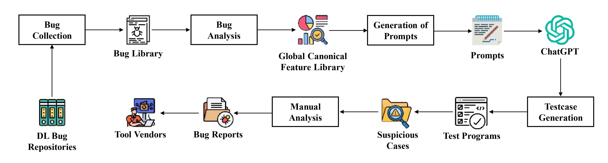

# Replication Package (ASE 2026) - Testing Deep-Learning libraries 

This repository is the replication package for our ASE 2026 submission entitled as  "LLM-based Feature-Guided Test Case Generation for Deep Learning Libraries".

## Overview of the pipeline

<p align="center">
  
</p>

<p align="center">
  <em>Figure 1. End-to-end workflow of the proposed bug-driven, GCFL-guided testcase generation and validation pipeline.</em>
</p>

The artifact contains:
- A curated **structured bug dataset** (JSON) mined from DL-library issue trackers.
- The **GCFL construction pipeline** (graph-based clustering over structured bug entries).
- Scripts to build **prompt packs** from GCFL clusters.
- The generated **testcases** (Python) following a strict execution contract.
- The Bugs reported to their respected DL libraries Bug repositories (reported_bugs.pdf) .
---

## What you can reproduce

### Main pipeline (end-to-end)
1) **Structured bug entries**
2) **GCFL clustering**
3) **Prompt packs** 
4) **LLM testcase generation (self-contained Python)** 
5) **Execution + triage (Pass/Fail/SKIP)**
6) **Manual confirmation + upstream reporting**

### Reported outcomes
- **130 executed testcases** produced **14 reported bugs**, with **5 developer-confirmed**.
---

## 2. Repository layout (recommended)

```text
.
testing_deeplearning_libraries/
├─ dataset/
│  ├─ testcases/
│  │  ├─ deepspeed/
│  │  ├─ keras/
│  │  ├─ tensorflow/
│  │  └─ tvm/
│  └─ testcases_generation/
│     └─ generate_testcases.py
├─ scripts/
│  ├─ gcfl/
│  │  ├─ GCFL_B_diag.json
│  │  ├─ GCFL_B.json
│  │  └─ gcfl_construction.py
│  ├─ prompt_pack_construction/
│  │  ├─ GCFL_B_loosen1_prompts_v2.json
│  │  ├─ GCFL_B_loosen1_prompts.json
│  │  ├─ make_prompt_pack_v2.py
│  │  └─ make_prompt_pack.py
│  ├─ bug_extraction.py
   └─ reported_bugs.pdf

````

## Execution contract (non-negotiable)

Every testcase in this repo follows the same **machine-checkable contract**.

### Required output

* Early: one line starting with `ENV:` containing JSON environment metadata.
* Final line must be **exactly one** of:

  * `Test Passed ✅`  → bug/suspicious behavior triggered
  * `Test Failed ❌`  → behavior not observed
  * `SKIP_ENV: <reason>` → environment mismatch / not runnable here

### Self-contained rule

* No external downloads, datasets, or network usage.
* No external config files required at repo level (if needed, testcase writes temp config files internally).

### Environment gating

Each testcase must SKIP if it cannot run correctly under the current environment (missing package, wrong version, missing GPU, insufficient GPU memory, missing multi-GPU, etc.).

---

## Step-by-step reproduction guide

### Step 0 — Prerequisites

You need:

* Python **3.10 or 3.11** (for most tests; exact versions depend on the testcase gating)
* Git
* (Optional but recommended) Conda or venv isolation
* GPU drivers if running GPU tests
* For distributed DeepSpeed tests: **2+ GPUs**, `torchrun` available

---

### Step 1 — Prepare the structured dataset

If you already have the structured dataset:

* Use `data/feature_all.json` (raw structured entries)

If your file is missing scenario labels, generate:

* `data/feature_all_with_scenario.json`

```
$IN0 = "...\data\feature_all.json"
$IN1 = "...\data\feature_all_with_scenario.json"
python tools/add_scenario.py --input $IN0 --output $IN1
```

This step assigns a single scenario label (e.g., `DISTRIBUTED`, `DATA_PIPELINE`, etc.) per entry based on `scope_tags`.

---

### Step 2 — Build GCFL clusters

GCFL builds clusters by graph construction:

* **Nodes** = structured bug entries
* **Edges** = shared structured signals (scenario/oracle/IDs/tags/keywords), under threshold rules
* **Clusters** = connected components (Union-Find/DSU)

```
$GCFL = "...\gcfl\GCFL_v12.py"
$IN   = "...\data\feature_all_with_scenario.json"
$OUTD = "...\gcfl\runs"
New-Item -ItemType Directory -Force -Path $OUTD | Out-Null

python $GCFL --plan B --within_scenario 1 --input $IN `
  --output (Join-Path $OUTD "GCFL_B.json") `
  --diagnostics (Join-Path $OUTD "GCFL_B_diagnostics.json") `
  --unmapped_report (Join-Path $OUTD "GCFL_B_unmapped_report.json")
```

**What to check**

* `GCFL_*_diagnostics.json` for:

  * number of clusters
  * singleton ratio
  * top cluster sizes
  * scenario distribution
* If you see a “mega cluster” swallowing everything, your edge rules are too loose.

---

### Step 3 — Generate prompt packs from GCFL

Prompt packs convert each cluster into a **test-generation specification**, including:

* target library + version range
* tier (S/M/L)
* allowed imports
* required oracle type
* knobs (ITERS/BATCH/SEQ/etc.)
* strict output contract + gating policy
* evidence members (for grounding)

```
$OUTDIR = "...\gcfl\runs"
$GCFL_JSON   = Join-Path $OUTDIR "GCFL_B.json"
$PROMPT_PACK = Join-Path $OUTDIR "GCFL_B_prompts_v2.json"

python prompts/make_prompt_pack_v2.py $GCFL_JSON $PROMPT_PACK
```

---

### Step 4 — Generate testcases from prompt packs (LLM)

Two valid modes:

#### Mode A: Use included generated tests (recommended for replication)

If the repo already contains the generated `.py` testcases, skip LLM generation and go to execution.

#### Mode B: Re-generate tests using an LLM

Use each prompt pack record to generate N testcases (e.g., N=10 for clusters ≥ 2).
Your generator must enforce:

* **no extra imports**
* **self-contained**
* **ENV line + final verdict line contract**
* **gating SKIP_ENV**
* **tier constraints (S/M/L)**
* **oracle type chosen before code**

---

### Step 5 — Execute tests (automatic batch running)

#### TensorFlow / Keras (single-process)

```bash
python runners/run_tf_batch.py \
  --input-dir testcases/tensorflow \
  --log-dir logs/tensorflow \
  --timeout 120
```

#### DeepSpeed distributed (multi-GPU only)

Run on Tier L (multi-GPU server), via `torchrun`:

```bash
export CUDA_VISIBLE_DEVICES=0,1
torchrun --nproc_per_node=2 testcases/deepspeed/<test>.py 2>&1 | tee logs/deepspeed/<test>.log
```

#### TVM

TVM tests are often build/install-sensitive; expect more SKIP_ENV. Run in an isolated environment with pinned TVM build if required.

---

### Step 6 — Summarize results

A summarizer scans logs and counts:

* Passed / Failed / Skipped
* per-library breakdown
* per-scenario breakdown
* number of unique bug reports and developer confirmations (tracked manually)

Example:

```bash
python tools/summarize_results.py --log-dir logs --out results_summary.json
```

---

### Step 7 — Manual confirmation and upstream reporting

Automation finds *suspicious* cases; it does not prove bugs by itself.

For each `Test Passed ✅` case:

* rerun multiple times (if nondeterminism risk)
* minimize the testcase
* check if it matches known issues
* file upstream issue with reproducible steps + logs

---

## How to reproduce paper tables/figures

Include scripts/notebooks that convert:

* `GCFL_*_diagnostics.json` → GCFL statistics tables/figures
* `results_summary.json` → evaluation tables (Pass/Fail/SKIP, reported/confirmed)

---

## Hardware tiers used in this work

* **Tier L (server)**: 4× RTX 3090, multi-GPU execution for distributed oracles.

Multi-GPU tests must gate themselves with `SKIP_ENV` when world_size < 2.

---

## Reproducibility checklist

* ✅ Can I build GCFL from the dataset?
* ✅ Can I regenerate prompt packs from GCFL?
* ✅ Can I run a batch of tests and get machine-checkable results?
* ✅ Do logs contain an ENV fingerprint?
* ✅ Are SKIP reasons explicit and not mislabeled failures?
* ✅ Are multi-GPU tests clearly separated and runnable via torchrun?

---


## Contact / Issues

Use file reported_bugs.pdf for viewing the bigs reported to Github bug repositories.

